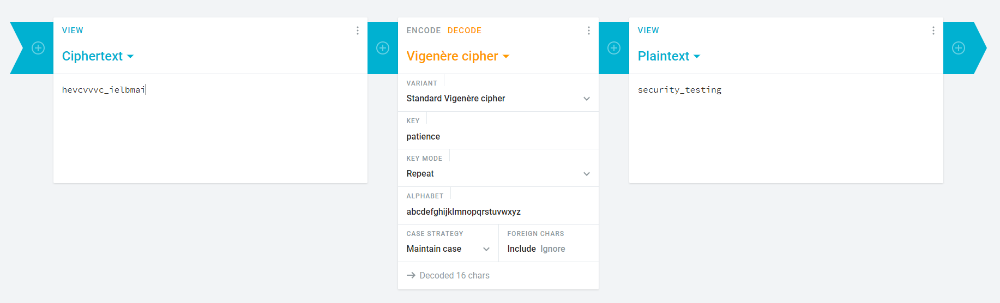

# French Crypt
## 50 points
### "The flag is: hevcvvvc_ielbmai"
### "The key is patience..."

-cifrul folosit este "Vigenère cipher", iar cheia este specificata in descriere "patience"

-putem folosi un tool online pt decriptare, ex: https://cryptii.com/pipes/vigenere-cipher

Flag: `TW{security_testing}`
