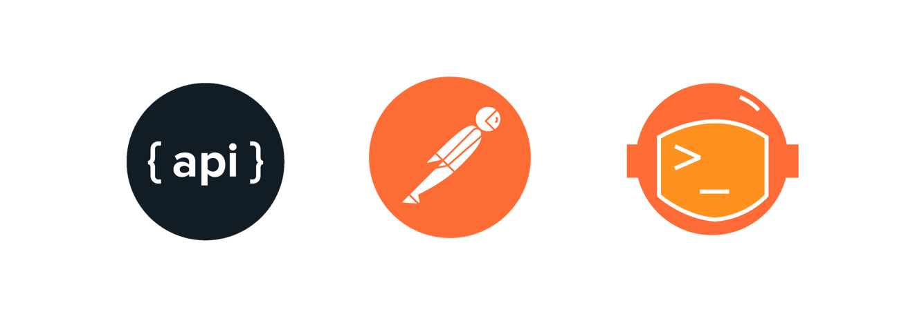

# Pay attention
## 150 points
### "The flag is hidden in this image, if you look closer you might see it.."

-trecem imagina prin utulitarul "strings" din linux ex: strings pic1.jpg

-trecem imagine printr-un tool online de analizat artefacte ale imaginilor ex: https://29a.ch/photo-forensics/#forensic-magnifier

Flag: `TW{congratulations}`